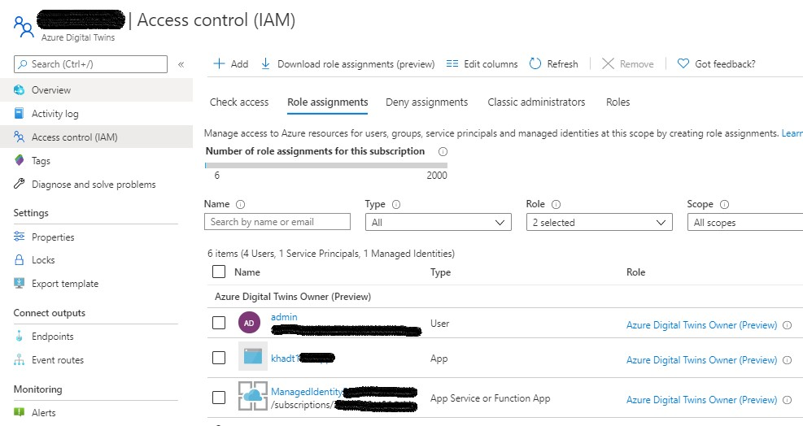

# Azure Digital Twins v2 authentication examples

This repo contains a Visual Studio solution with several C# examples for authenticating and querying the [**Microsoft Azure Digital Twins**](https://docs.microsoft.com/en-us/azure/digital-twins/overview) service using the [**Azure.Identity**](https://docs.microsoft.com/en-us/dotnet/api/azure.identity?view=azure-dotnet) and the [**Azure Digital Twins**](https://www.nuget.org/packages/Azure.DigitalTwins.Core/1.0.0-preview.3) SDKs.

For interactive applications, use the **Interactive** example. For non-interactive applications, use either **Client Secret** or **Managed Identity** samples. Ensure ADT and AAD is setup appropriately for the authentication type you choose. See [**ADT and AAD Setup**](#ADT-and-AAD-Setup) below.

You can also use ```DefaultAzureCredential``` which provides a default TokenCredential authentication flow for applications that will be deployed to Azure. The following credential types if enabled will be tried, in order:

- EnvironmentCredential
- ManagedIdentityCredential
- SharedTokenCacheCredential
- InteractiveBrowserCredential

However, I've found that ```DefaultAzureCredential``` can also slow down your auth code as it tries the various credential types. So if you know which credential type you are going to use, I'd recommend just using that specific credential type class as shown in the following examples.

## Interactive

```
using System;
using System.Threading.Tasks;
using Azure.Identity;
using Azure.DigitalTwins.Core;
using Azure.DigitalTwins.Core.Models;
using Azure;

namespace Interactive
{
    class Program
    {
        // Your client / app registration ID
        private static string clientId = "<your client ID>";
        // Your tenant / directory ID
        private static string tenantId = "<your AAD tenant ID>";
        // The URL of your instance, starting with the protocol (https://)
        private static string adtInstanceUrl = "https://<your ADT instance>";

        static async Task Main(string[] args)
        {
            DigitalTwinsClient client;

            try
            {
                var credential = new InteractiveBrowserCredential(tenantId, clientId);

                // Open a browser window and allow user to select which account to authenticate with
                // If you omit this, the browser will only be launched to authenticate the user once, 
                // then will silently acquire access tokens through the users refresh token as long as it's valid.
                // So if you are switching between AAD accounts, keep this uncommented.
                var auth_result = credential.Authenticate();
                Console.WriteLine($"Sucessfully authenticated as: {auth_result.Username}");

                client = new DigitalTwinsClient(new Uri(adtInstanceUrl), credential);

                AsyncPageable<ModelData> modelList = client.GetModelsAsync(null, true);

                await foreach (ModelData md in modelList)
                {
                    Console.WriteLine($"Id: {md.Id}");
                }

                Console.WriteLine("Done");
            }
            catch (Exception e)
            {
                Console.WriteLine($"Authentication or client creation error: {e.Message}");
                Environment.Exit(0);
            }
        }
    }
}
```

## Client Secret

```
using System;
using System.Threading.Tasks;
using Azure.Identity;
using Azure.DigitalTwins.Core;
using Azure.DigitalTwins.Core.Models;
using Azure;

namespace ClientSecret
{
    class Program
    {
        // Your client / app registration ID
        private static string clientId = "<your client ID>";
        // Your tenant / directory ID
        private static string tenantId = "<your AAD directory ID>";
        // The URL of your instance, starting with the protocol (https://)
        private static string adtInstanceUrl = "https://<your ADT instance>";
        // Your client secret from your app registration
        private static string secret = "<your client secret>";

        static async Task Main(string[] args)
        {
            DigitalTwinsClient client;

            try
            {
                var credential = new ClientSecretCredential(tenantId, clientId, secret);

                client = new DigitalTwinsClient(new Uri(adtInstanceUrl), credential);

                AsyncPageable<ModelData> modelList = client.GetModelsAsync(null, true);

                await foreach (ModelData md in modelList)
                {
                    Console.WriteLine($"Id: {md.Id}");
                }

                Console.WriteLine("Done");
            }
            catch (Exception e)
            {
                Console.WriteLine($"Authentication or client creation error: {e.Message}");
                Environment.Exit(0);
            }
        }
    }
}
```

## Managed Identity

```
using System;
using System.Threading.Tasks;
using Microsoft.AspNetCore.Mvc;
using Microsoft.Azure.WebJobs;
using Microsoft.Azure.WebJobs.Extensions.Http;
using Microsoft.AspNetCore.Http;
using Microsoft.Extensions.Logging;
using Azure.Identity;
using Azure.DigitalTwins.Core;
using System.Net.Http;
using Azure.Core.Pipeline;
using Azure.DigitalTwins.Core.Models;
using Azure;

namespace ManagedIdentity
{
    public static class Function1
    {
        const string adtAppId = "https://digitaltwins.azure.net";
        private static string adtInstanceUrl = "https://<your ADT instance>";
        private static HttpClient httpClient = new HttpClient();

        [FunctionName("Function1")]
        public static async Task<IActionResult> Run(
            [HttpTrigger(AuthorizationLevel.Function, "get", Route = null)] HttpRequest req,
            ILogger log)
        {
            log.LogInformation("C# HTTP trigger function processed a request.");

            DigitalTwinsClient client;
            AsyncPageable<ModelData> modelList;

            try
            {
                ManagedIdentityCredential cred = new ManagedIdentityCredential(adtAppId);

                DigitalTwinsClientOptions opts = new DigitalTwinsClientOptions { Transport = new HttpClientTransport(httpClient) };

                client = new DigitalTwinsClient(new Uri(adtInstanceUrl), cred, opts);

                modelList = client.GetModelsAsync(null, true);

                await foreach (ModelData md in modelList)
                {
                    log.LogInformation($"Id: {md.Id}");
                }

                log.LogInformation("Done");
            }
            catch (Exception e)
            {
                log.LogCritical($"Authentication or client creation error: {e.Message}");
                return new BadRequestObjectResult(e.Message);
            }

            return new OkObjectResult(modelList);
        }
    }
}
```

## ADT and AAD Setup

Login to the CLI
```
az login
```
Set your subscription
```
az account set --subscription "your-Azure-subscription-name"
```
Get your directory (tenant) Id.
```
az account show
```
Copy the ```tenantId``` value and use this for the ```tenantId``` in the above code samples.

Add the IoT extension to your CLI if you haven't already.
```
az extension add --name azure-iot
```
Create a resource group.
```
az group create --location westus2 --name <your-resource-group-name>
```
Create your ADT instance. Ensure you use a region where the ADT service is available.
```
az dt create --dt-name <your ADT instance name> -g <your-resource-group-name> -l westus2
```
Copy the ```hostName``` value and use this for the ```adtInstanceUrl``` in the above code samples.

Add your AAD account (likely your email account) to an [ADT role](https://docs.microsoft.com/en-us/azure/digital-twins/concepts-security#authorization-rbac-roles-for-azure-digital-twins). This is required if you want to login interactively to ADT using Postman or using the **Interactive** sample above.
```
az dt role-assignment create --dt-name <your-ADT-instance-name> --assignee "<your-AAD-account>" --role "Azure Digital Twins Owner (Preview)"
```
Save the following JSON snippet as ```manifest.json```. You can read more about application manifests [here](https://docs.microsoft.com/en-us/azure/active-directory/develop/reference-app-manifest).
```
[{
    "resourceAppId": "0b07f429-9f4b-4714-9392-cc5e8e80c8b0",
    "resourceAccess": [
     {
       "id": "4589bd03-58cb-4e6c-b17f-b580e39652f8",
       "type": "Scope"
     }
    ]
}]
```
Create an app registration in AAD. Your client app authenticates against the app registration, and as a result is granted the configured access permissions to the ADT APIs.
```
az ad app create --display-name <your-app-registration-name> --native-app --required-resource-accesses manifest.json --reply-url http://localhost
```
Copy the **appId** and use this as the ```clientId``` in the above code samples and to create a service principal for your AAD app.
```
az ad sp create --id <appId>
```
This next step will give your AAD **appId** permissions to the ADT API.
```
az dt role-assignment create --dt-name <your-ADT-instance-name> --assignee "<appId>" --role "Azure Digital Twins Owner (Preview)"
```
Now, let's finish configuring the app registration.

- Open the app registration in the **Azure Portal > Azure Active Directory > App registrations > your-app-registration**.
- Under **Authentication**, update the redirect URIs in your AAD app registration as needed to suit your application needs. If you are just using the above code samples, no additional redirect URIs need to be added. However, if using **Postman**, click **Add a platform**, select **Web** and added the following:
  - https://oauth.pstmn.io/v1/callback
  - https://www.getpostman.com/oauth2/callback
- Under **Authentication**, enable **Implicit grant** by enabling **Access tokens** (**ID tokens** should already be enabled).
- Click **Save**.
- Under **API permissions**, click **Add a permission**, select **Azure Service Management**, enable **user_impersonation** and click **Add permissions**

Now you can run the **Interactive** code sample.

To run the **Client Secret** code sample, create a client secret in the AAD app registration. To create a client secret:

- Open the app registration in the **Azure Portal > Azure Active Directory > App registrations > your-app registration > Certificates and secrets**.
- Click **New client secret**, create the new secret and copy the secret value to use in the code sample.

Now you can run the **Client secret** code sample.

To run the **Managed Identity** code sample you will need to created a managed identity for the App Service hosting the Azure Function and assign that managed identity to an ADT role.

- Publish the Azure Function to an Azure App Service
- Create a managed identity for App Service by going to the **Azure Portal > App Services > your-app-service > Identity** and set the **Status** to **On**.
- Assign the managed identity an ADT role by:
  - **Azure Portal > Azure Digital Twins > your-ADT-instance > Access control (IAM) > Role assignments > Add > Add role assignment**
  - Under **Role** select the **Azure Digital Twins Owner (Preview)** role, under **Assign access to** choose **Function App** and select the managed identity of your function app.
  - Click **Save**.

Verify your ADT instance's **Access control (IAM)** settings are correct. You should have your AAD user account, other AAD user accounts (optional), the AAD app, and the managed identity belonging to the Function App listed as members of the **Azure Digital Twins Owner (Preview)** role.



Now you can run the **Managed Identity** code sample.

## References

- [Create an ADT instance](https://docs.microsoft.com/en-us/azure/digital-twins/how-to-set-up-instance)
- [az dt CLI reference](https://docs.microsoft.com/en-us/cli/azure/ext/azure-iot/dt?view=azure-cli-latest)
- [Authenticate a client application](https://docs.microsoft.com/en-us/azure/digital-twins/how-to-authenticate-client)
- [What is Azure RBAC](https://docs.microsoft.com/en-us/azure/role-based-access-control/overview)
- [ADT RBAC Roles](https://docs.microsoft.com/en-us/azure/digital-twins/concepts-security#authorization-rbac-roles-for-azure-digital-twins)
- [About Managed Identities](https://docs.microsoft.com/en-us/azure/active-directory/managed-identities-azure-resources/overview)
- [Azure.Identity](https://github.com/Azure/azure-sdk-for-net/tree/master/sdk/identity/Azure.Identity)

## TODO

- Translate app registration configuration and managed identity steps into CLI.
- Determine a way to remove the Azure Service Management API permission in order to run the Interactive code sample. Currently, leaving this off breaks the code sample.